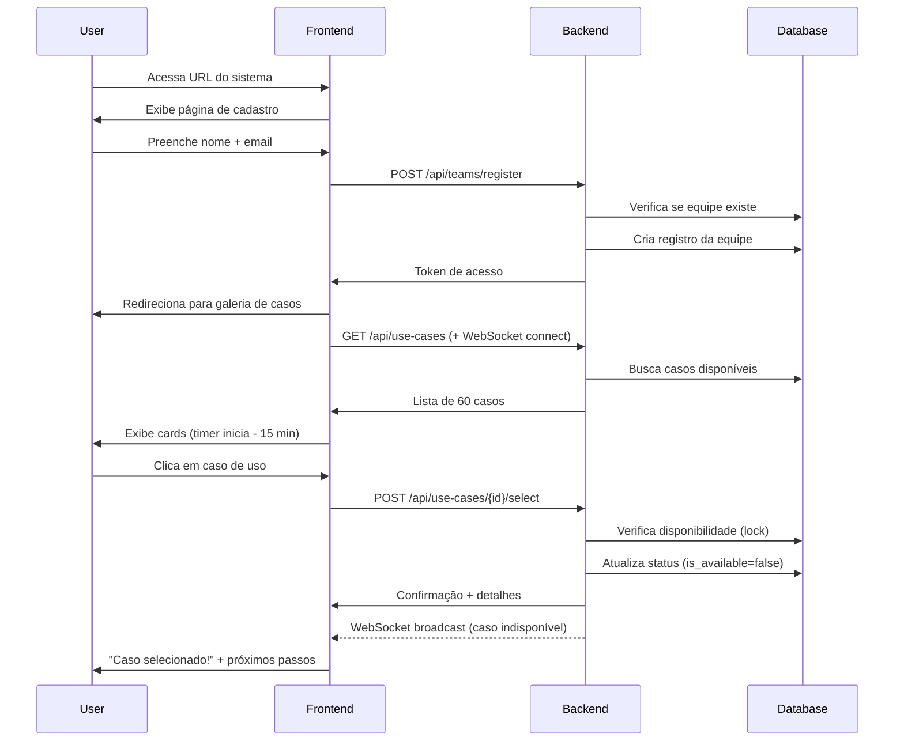
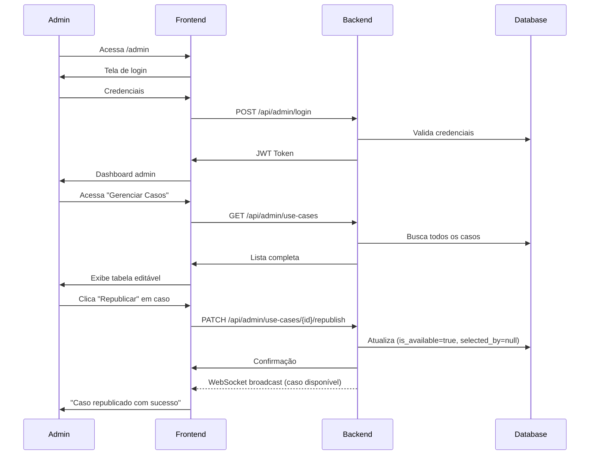
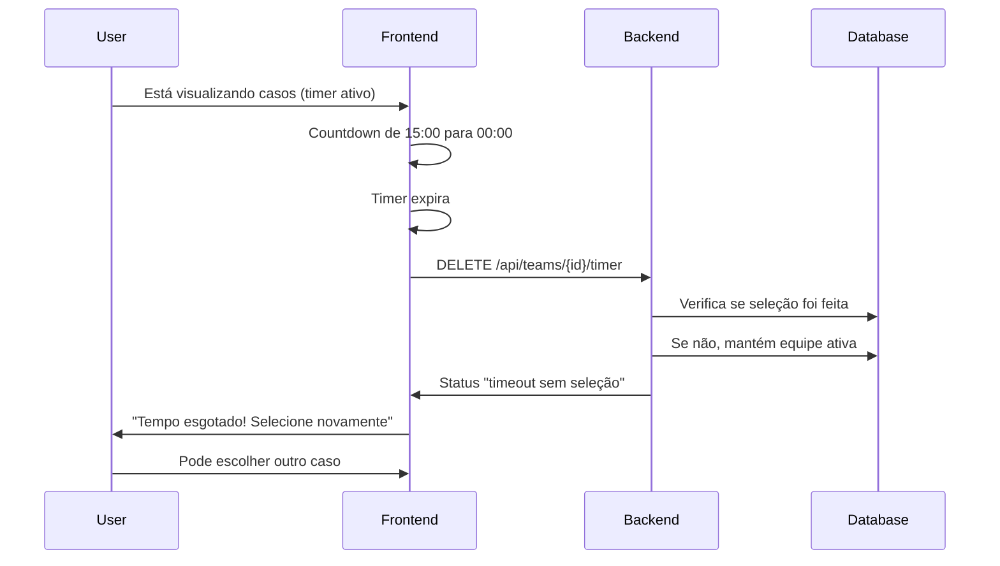

# Discovery Document - EvolveAI Hackathon Brasil
## Sistema de Seleção de Casos de Uso

**Documento:** Discovery Avanade Structured Methodology  
**Projeto:** Plataforma de Seleção de Casos de Uso - EvolveAI Hackathon  
**Data:** 27 de Janeiro de 2026  
**Analista:** Maria - Business Analyst Avanade  
**Status:** Initial Discovery  
**Versão:** 1.0

---

## 📋 Executive Summary

### Visão Geral do Projeto
Sistema web para gerenciar a seleção de casos de uso durante o EvolveAI Hackathon Brasil, permitindo que 300 equipes escolham entre 60 casos de uso disponíveis, com gestão de disponibilidade em tempo real e área administrativa para organizadores.

### Objetivos de Negócio
1. **Eficiência Operacional**: Automatizar processo de seleção de casos de uso, eliminando processos manuais
2. **Controle de Disponibilidade**: Garantir que cada caso seja selecionado por apenas uma equipe
3. **Experiência do Participante**: Fornecer interface intuitiva com tempo controlado de seleção (15 minutos)
4. **Visibilidade Administrativa**: Permitir que organizadores monitorem seleções em tempo real e exportem relatórios
5. **Time-to-Market**: Desenvolver MVP funcional em 1 dia

### Métricas de Sucesso
- ✅ 300 equipes conseguem acessar e selecionar casos simultaneamente
- ✅ 0% de casos duplicados (mesma seleção por múltiplas equipes)
- ✅ 100% de casos disponíveis visíveis em tempo real
- ✅ Admins conseguem exportar relatório completo em Excel
- ✅ Sistema disponível e estável durante todo o evento

---

## 👥 Stakeholder Analysis

### Primary Stakeholders

#### 1. Organizadores do Hackathon (Administradores)
**Perfil:**
- Equipe organizadora do EvolveAI Hackathon Brasil
- Responsáveis por configurar, monitorar e gerenciar o evento

**Necessidades:**
- Cadastrar e editar 60 casos de uso
- Visualizar status de seleção em tempo real
- Identificar quais equipes selecionaram cada caso
- Exportar relatórios em Excel
- Republicar casos se necessário
- Acesso autenticado e seguro

**Pain Points:**
- Processos manuais de atribuição de casos de uso
- Falta de visibilidade em tempo real
- Risco de duplicação de seleções
- Dificuldade em gerar relatórios rápidos

#### 2. Participantes do Hackathon (Equipes)
**Perfil:**
- ~300 equipes participantes
- Buscam selecionar caso de uso alinhado com suas competências

**Necessidades:**
- Visualizar todos os 60 casos disponíveis (como um cardápio)
- Filtrar/navegar por categoria (Indústria, Práticas, Cases)
- Entender detalhes antes de selecionar (título, descrição)
- Confirmar seleção e receber próximos passos
- Recuperar acesso com nome da equipe + email
- Ter 15 minutos para decidir sem pressão externa

**Pain Points:**
- Tempo limitado para escolha (15 min)
- Incerteza sobre disponibilidade do caso desejado
- Necessidade de entender rapidamente múltiplos casos

### Secondary Stakeholders
- **Equipe de Suporte Técnico**: Precisam de sistema estável e de fácil troubleshooting
- **Mentores do Hackathon**: Podem precisar consultar quais casos foram selecionados

---

## 🎯 Business Requirements

### Functional Requirements

#### FR-001: Cadastro de Participantes
**Prioridade:** ALTA  
**Descrição:** Participantes devem se cadastrar com nome da equipe e email válido  
**Critérios de Aceitação:**
- Sistema valida formato de email
- Nome da equipe é obrigatório (mínimo 3 caracteres)
- Combinação nome+email cria identificador único
- Participante pode retornar usando mesmo nome+email

#### FR-002: Visualização de Casos de Uso
**Prioridade:** ALTA  
**Descrição:** Exibir 60 casos de uso em formato de cards organizados por categoria  
**Critérios de Aceitação:**
- Cards mostram: Título, Descrição, Categoria (Indústria/Práticas/Cases)
- Indicação visual clara de disponibilidade (disponível/selecionado)
- Filtros por categoria funcionais
- Interface responsiva para diferentes dispositivos

#### FR-003: Seleção de Caso de Uso
**Prioridade:** CRÍTICA  
**Descrição:** Processo de seleção com timer de 15 minutos e bloqueio de disponibilidade  
**Critérios de Aceitação:**
- Timer de 15 minutos inicia ao entrar na página de seleção
- Contador visível para o usuário
- Seleção trava o caso para outras equipes instantaneamente
- Após timeout, caso volta a disponível se não confirmado
- Uma equipe pode selecionar apenas 1 caso
- Mensagem de confirmação exibe: "Caso de uso selecionado!" + detalhes + próximos passos

#### FR-004: Controle de Disponibilidade
**Prioridade:** CRÍTICA  
**Descrição:** Garantir que cada caso seja selecionado por apenas uma equipe  
**Critérios de Aceitação:**
- Casos selecionados aparecem como "indisponíveis" para todos os usuários
- Sincronização em tempo real (máximo 2 segundos de delay)
- Se equipe não confirma em 15 min, caso fica disponível novamente
- Equipe que perdeu timer pode selecionar outro caso disponível

#### FR-005: Área Administrativa
**Prioridade:** ALTA  
**Descrição:** Dashboard para organizadores gerenciarem casos de uso  
**Critérios de Aceitação:**
- Autenticação segura (usuário/senha)
- CRUD completo de casos de uso (Criar, Ler, Editar, Deletar)
- Visualização de status: total de casos, selecionados, disponíveis
- Lista de seleções com equipe + caso + timestamp
- Botão para republicar caso (tornar disponível novamente)

#### FR-006: Exportação de Relatórios
**Prioridade:** ALTA  
**Descrição:** Exportar relatório de seleções em formato Excel  
**Critérios de Aceitação:**
- Arquivo Excel contém: Nome da Equipe, Email, Caso Selecionado, Categoria, Timestamp
- Botão de exportação no dashboard admin
- Download imediato do arquivo
- Nomenclatura: `relatorio-selecoes-YYYYMMDD-HHMM.xlsx`

#### FR-007: Recuperação de Acesso
**Prioridade:** MÉDIA  
**Descrição:** Participante pode retornar ao sistema após logout  
**Critérios de Aceitação:**
- Login com nome da equipe + email
- Sistema recupera status da seleção
- Se já selecionou, mostra caso escolhido e próximos passos
- Se não selecionou, retorna para tela de seleção

### Non-Functional Requirements

#### NFR-001: Performance
- Sistema deve suportar 300 acessos simultâneos
- Tempo de resposta < 2 segundos para operações CRUD
- Atualização de disponibilidade em tempo real (websockets ou polling < 3s)

#### NFR-002: Disponibilidade
- Uptime de 99.9% durante período do evento
- Sistema deve ser testado com carga antes do evento

#### NFR-003: Usabilidade
- Interface intuitiva, sem necessidade de treinamento
- Responsivo para desktop, tablet e mobile
- Feedback visual claro para todas as ações

#### NFR-004: Segurança
- Autenticação segura para área administrativa
- Proteção contra seleção duplicada (race conditions)
- Logs de auditoria para todas as seleções

#### NFR-005: Escalabilidade
- Arquitetura preparada para aumentar de 60 para 100+ casos
- Banco de dados dimensionado para 500 equipes (margem de segurança)

#### NFR-006: Manutenibilidade
- Código limpo e documentado
- Deploy simples (infra minimalista)
- Fácil configuração de variáveis (timer, quantidade de casos)

---

## 🏗️ Solution Architecture Overview

### Technology Stack Recommendation

#### Frontend
**Opção Recomendada:** React + Vite
- **Justificativa:** Desenvolvimento rápido, componentes reutilizáveis, ecossistema maduro
- **Bibliotecas:**
  - Material-UI ou Tailwind CSS (UI components)
  - React Router (navegação)
  - Axios (requisições HTTP)
  - Socket.io-client (atualizações em tempo real)
  - React Hook Form (formulários)

#### Backend
**Opção Recomendada:** Node.js + Express
- **Justificativa:** Rápido para prototipar, JavaScript full-stack, boa performance
- **Bibliotecas:**
  - Express.js (servidor HTTP)
  - Socket.io (websockets)
  - jsonwebtoken (autenticação admin)
  - exceljs (geração de Excel)
  - bcrypt (hash de senhas)

#### Database
**Opção Recomendada:** PostgreSQL (ou SQLite para MVP extremamente rápido)
- **Justificativa:** Relacional, ACID-compliant (evita race conditions), gratuito
- **Alternativa MVP:** MongoDB (schema-less, deploy rápido)

#### Hosting (Infra Simples)
**Opções:**
1. **Vercel** (Frontend) + **Render/Railway** (Backend + DB)
2. **Heroku** (Full-stack em um lugar)
3. **Azure Web Apps** (se houver créditos Avanade)

### Data Model

#### Entidades Principais

**1. Team (Equipe)**
```
- id: UUID (PK)
- name: String (NOT NULL)
- email: String (NOT NULL, UNIQUE)
- selected_use_case_id: UUID (FK -> UseCase)
- selection_timestamp: DateTime
- timer_started_at: DateTime
- created_at: DateTime
```

**2. UseCase (Caso de Uso)**
```
- id: UUID (PK)
- title: String (NOT NULL)
- description: Text
- category: Enum (Industria | Praticas | Cases)
- subcategory: String (ex: "Cliente X", "Interna")
- is_available: Boolean (DEFAULT true)
- selected_by_team_id: UUID (FK -> Team, NULLABLE)
- created_at: DateTime
- updated_at: DateTime
```

**3. Admin (Administrador)**
```
- id: UUID (PK)
- username: String (NOT NULL, UNIQUE)
- password_hash: String (NOT NULL)
- created_at: DateTime
```

**4. SelectionLog (Log de Auditoria)**
```
- id: UUID (PK)
- team_id: UUID (FK -> Team)
- use_case_id: UUID (FK -> UseCase)
- action: Enum (RESERVED | SELECTED | TIMEOUT | RELEASED)
- timestamp: DateTime
```

### System Architecture Diagram

```
┌─────────────────┐
│   FRONTEND      │
│   (React/Vite)  │
│                 │
│ - Landing       │
│ - Cadastro      │
│ - Seleção Cards │
│ - Admin Panel   │
└────────┬────────┘
         │ HTTP/WebSocket
         │
┌────────▼────────┐
│   BACKEND       │
│   (Node/Express)│
│                 │
│ - API REST      │
│ - WebSocket     │
│ - Auth JWT      │
│ - Timer Control │
└────────┬────────┘
         │
┌────────▼────────┐
│   DATABASE      │
│   (PostgreSQL)  │
│                 │
│ - Teams         │
│ - UseCases      │
│ - Logs          │
└─────────────────┘
```

---

## 🔄 User Flows

### Flow 1: Participante - Primeira Seleção



### Flow 2: Admin - Gerenciamento de Casos



### Flow 3: Timeout de Seleção



---

## 📊 Feature Breakdown & Prioritization

### MVP (Must Have) - Dia 1
**Prazo:** 1 dia de desenvolvimento

| Feature | Priority | Effort | Complexity |
|---------|----------|--------|------------|
| Cadastro de equipe | P0 | 2h | Baixa |
| CRUD Admin de casos de uso | P0 | 3h | Média |
| Galeria de cards (60 casos) | P0 | 4h | Média |
| Seleção com bloqueio (race condition) | P0 | 4h | Alta |
| Timer de 15 minutos | P0 | 2h | Média |
| Dashboard admin (visibilidade) | P0 | 3h | Média |
| Exportação Excel | P0 | 2h | Baixa |
| Deploy infra simples | P0 | 2h | Média |

**Total Estimado:** ~22 horas (desenvolvimento intensivo, 2-3 devs)

### Phase 2 (Nice to Have) - Pós-evento
- Notificações por email ao selecionar
- Sistema de fila (se caso ficar disponível, notificar interessados)
- Analytics de tempo de seleção por categoria
- Histórico de republicações
- Filtros avançados (busca por palavra-chave)

---

## ⚠️ Risks & Mitigation

### Risk Matrix

| Risk | Impact | Probability | Mitigation |
|------|--------|-------------|------------|
| **Race condition em seleções** | ALTA | MÉDIA | Implementar transações database com locks pessimistas + testes de carga |
| **300 acessos simultâneos no lançamento** | ALTA | ALTA | Load testing com k6/Artillery + CDN para assets estáticos + WebSocket connection pooling |
| **Timer não sincronizado com backend** | MÉDIA | MÉDIA | Timer gerenciado no backend, frontend apenas exibe countdown + validação dupla |
| **Prazo de 1 dia insuficiente** | ALTA | MÉDIA | Stack tecnológica conhecida + scope rigoroso no MVP + pair programming |
| **Infra simples cair durante evento** | ALTA | BAIXA | Monitoramento em tempo real + plano de contingência (backup deploy ready) |
| **Admin perder acesso** | MÉDIA | BAIXA | Múltiplos usuários admin + recovery por email/suporte |
| **Casos duplicados por bug** | ALTA | BAIXA | Testes de integração + constraints database (UNIQUE) + logs de auditoria |

---

## 📅 Implementation Roadmap

### Day 1 - MVP Development (8h sprint)

**Morning (4h):**
- ✅ Setup do projeto (Vite + Express + PostgreSQL/MongoDB)
- ✅ Data model + migrations
- ✅ Autenticação admin básica
- ✅ CRUD de casos de uso (admin)
- ✅ Seeding de dados (60 casos de exemplo)

**Afternoon (4h):**
- ✅ Cadastro de equipes
- ✅ API de listagem de casos (com filtros)
- ✅ Lógica de seleção com lock
- ✅ Timer de 15 minutos (backend + frontend)
- ✅ WebSocket para atualizações em tempo real

**Evening (3h):**
- ✅ Frontend: Galeria de cards + filtros
- ✅ Frontend: Admin dashboard + exportação Excel
- ✅ Testes de race condition
- ✅ Deploy em Vercel + Render

**Night (2h):**
- ✅ Testes de carga (simular 300 acessos)
- ✅ Ajustes finais de UX
- ✅ Documentação de uso para admins

---

## 📈 Success Metrics & KPIs

### Operational Metrics
- **Tempo Médio de Seleção:** < 10 minutos (dos 15 disponíveis)
- **Taxa de Timeout:** < 15% das equipes
- **Taxa de Sucesso de Seleção:** 100% (todos os casos alocados sem duplicatas)
- **Concurrent Users Supported:** 300+ simultâneos

### Business Metrics
- **Adoção:** 100% das equipes usam o sistema (vs processo manual)
- **Satisfação Admin:** 9/10 em facilidade de gestão
- **Tempo de Setup Administrativo:** < 30 minutos para cadastrar 60 casos

### Technical Metrics
- **Uptime:** 99.9% durante evento
- **Response Time (p95):** < 2 segundos
- **Zero Critical Bugs:** Nenhum bug bloqueador durante evento

---

## 🔍 Open Questions & Next Steps

### Pending Decisions
1. **Tecnologia de Database:** PostgreSQL (mais robusto) vs MongoDB (mais rápido para MVP)?
2. **Autenticação Admin:** JWT simples ou OAuth com Google/Microsoft?
3. **Estratégia de Teste de Carga:** Contratar serviço ou usar ferramentas open-source?
4. **Backup de Dados:** Frequência de backup durante evento?

### Immediate Next Steps
1. ✅ **Validar Stack Tecnológica** com equipe de desenvolvimento
2. ✅ **Confirmar Credenciais de Deploy** (Vercel, Render, etc)
3. ✅ **Preparar Dados dos 60 Casos** em formato estruturado (CSV/JSON)
4. ✅ **Definir Credenciais Admin** (quantos usuários, como distribuir)
5. ✅ **Agendar Sessão de Testes** (1-2h antes do evento)

### Follow-up Actions
- [ ] Criar repositório Git com estrutura inicial
- [ ] Configurar CI/CD pipeline básico
- [ ] Documentar API endpoints (Swagger/Postman)
- [ ] Preparar runbook de troubleshooting para dia do evento
- [ ] Treinar organizadores no uso do dashboard admin

---

## 📎 Appendices

### Appendix A: Sample Use Case Data Structure
```json
{
  "id": "uuid-v4",
  "title": "Otimização de Supply Chain com IA",
  "description": "Desenvolver modelo preditivo para otimizar logística de distribuição em rede varejista com 500+ pontos de venda",
  "category": "Industria",
  "subcategory": "Varejo",
  "is_available": true,
  "selected_by_team_id": null,
  "created_at": "2026-01-27T10:00:00Z"
}
```

### Appendix B: Suggested Admin Credentials Setup
- **Primary Admin:** hackathon.admin@evolveai.com
- **Backup Admin:** support@evolveai.com
- **Password Policy:** Mínimo 12 caracteres, incluindo símbolos

### Appendix C: Sample Next Steps Message (Post-Selection)
```
🎉 CASO DE USO SELECIONADO COM SUCESSO! 🎉

Caso: [Título do Caso]
Equipe: [Nome da Equipe]

PRÓXIMOS PASSOS:
1. Junte-se ao canal Discord: #caso-[id]
2. Encontre seu mentor designado até 14h
3. Prepare pitch inicial para apresentação às 16h
4. Acesse materiais de apoio: [link]

Dúvidas? Procure a equipe de suporte na área central.

Boa sorte! 🚀
```

---

## ✍️ Document Sign-off

**Preparado por:** Maria - Business Analyst Avanade  
**Revisão Técnica:** [Pendente]  
**Aprovação Stakeholder:** [Pendente]  

**Data de Criação:** 27/01/2026  
**Última Atualização:** 27/01/2026  
**Próxima Revisão:** Após validação com equipe técnica

---

**Status do Documento:** 🟢 PRONTO PARA VALIDAÇÃO TÉCNICA

Este discovery fornece base sólida para iniciar desenvolvimento. Recomenda-se:
1. Validar stack tecnológica com desenvolvedores
2. Confirmar viabilidade do prazo de 1 dia
3. Preparar dados dos 60 casos de uso
4. Definir estratégia de testes de carga

---

*Documento gerado seguindo Avanade Structured Discovery Methodology*
